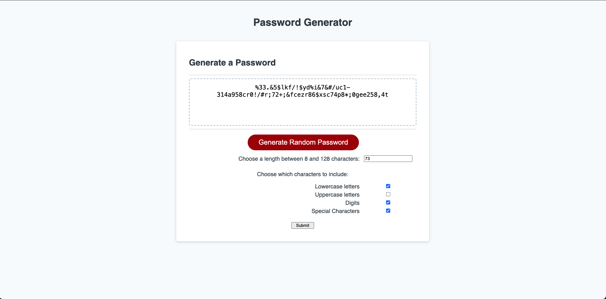

# UTA Coding Bootcamp Challenge 3

## Description

This is my submission for the third challenge in the UTA/EdX Coding Bootcamp. The goal of this challenge was to create a password generator with javascript.
The website prompts you to choose a number of characters between 8 and 128 and asks which character types to include from the list of Lowercase Letters, Uppercase Letters, Digits, and Special Characters.
The program then outputs a string of the inputted length made of the specified character types selected.

<a href="https://njmeister.github.io/UTA-bootcamp-challenge-3/">Link</a>

## Installation

N/A

## Usage
The website prompts you to choose a number of characters between 8 and 128 and asks which character types to include from the list of Lowercase Letters, Uppercase Letters, Digits, and Special Characters.
The program then outputs a string of the inputted length made of the specified character types selected. If the number entered does not fall between 8 and 128 or no categories are selected, an error alert is instead displayed.

## Credits

The code to shuffle the characters (lines 87-96) comes from 
<link href="https://bost.ocks.org/mike/shuffle/">Mike Bostock's Fisher-Yates Shuffle code.</linkk>

## License

This repo uses an MIT License. See above for details.
